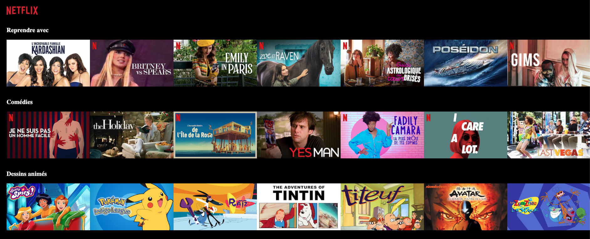

# Netflix React - Frontend Clone 🔴

As part of my training at [Le Reacteur](https://www.lereacteur.io/) to become a full-stack developer, we were tasked with recreating a simple [Netflix](https://www.netflix.com/fr/) website, using the .json file given by the bootcamp.

_This website is just an exercise and will not be deployed or used, besides as a portfolio piece. All the images and links used are not my property._

## Overview 🚀

Check out the live demo [here](https://potaaeeto.github.io/NetflixReact/) and test it! 😊

It is mainly built using ReactJS and CSS.



## Tasks 🧐

✓ Creation of components

✓ Use of .json file

✓ Implementing integration (CSS and ReactJS)

## Stacks 📚

- ReactJS
- JavaScript
- HTML5
- CSS3

## Prerequisites 🤔

Before you begin, ensure you have met the following requirements:

✓ [Git](https://git-scm.com/downloads) must be installed on your operating system.

## Installing Netflix React Clone 🗝️

To install the website, follow these steps:

1. Clone this repository or download the ZIP file

```bash
git clone https://github.com/Potaaeeto/NetflixReact.git
```

```bash
cd NetflixReact
```

2. Install packages

```bash
yarn
```

3. When installation is complete

```bash
yarn dev
```
